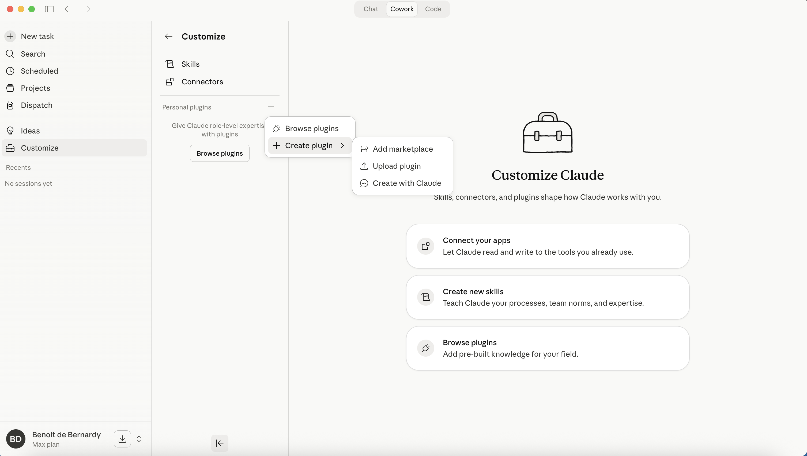
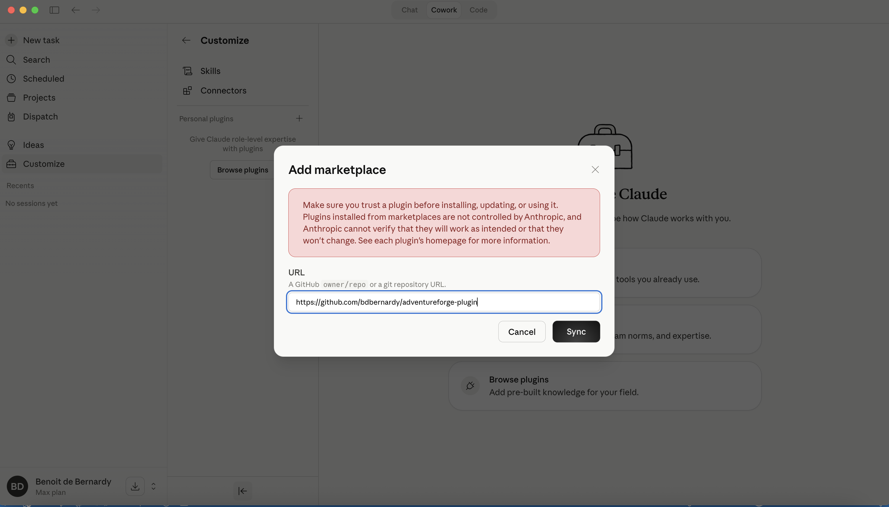
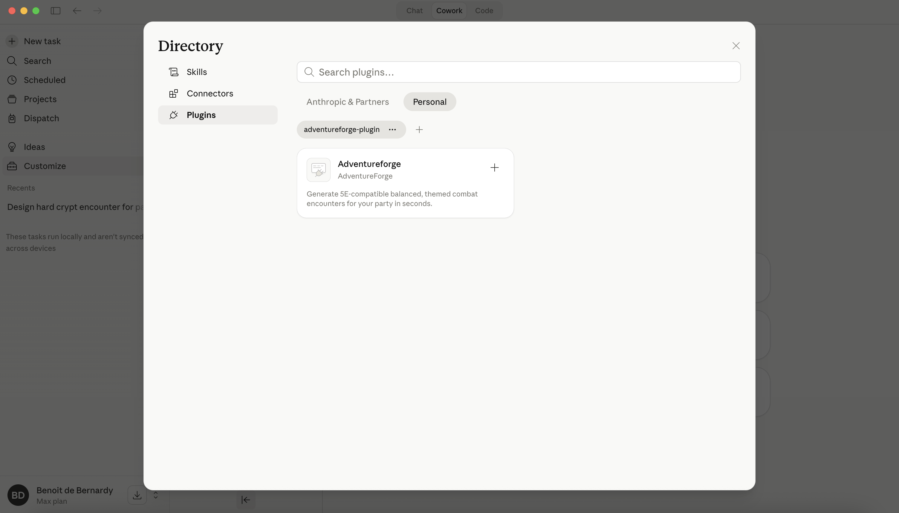

# Installing Chucks in Cowork

Cowork uses a graphical setup rather than slash commands. These steps walk you through adding the Chucks marketplace, installing the plugin, and enabling its connector so Claude can actually call the monster-database tools.

## 1. Open Customize

In the Cowork sidebar, click **Customize**.

## 2. Start adding a marketplace

Next to **Personal plugins**, click the **+** button, then choose **Create plugin** → **Add marketplace**.



## 3. Paste the marketplace URL

In the dialog that appears, paste the Chucks repository URL and click **Sync**:

```
https://github.com/chucks-ai/claude
```



## 4. Install the plugin

Open the plugin directory, switch to the **Personal** tab, find the **Chucks** card, and click its **+** button.



## 5. Enable the connector

Switch to the **Connectors** tab in the same directory and enable the **chucks** connector. This is what lets Claude reach the Chucks monster database at runtime — the plugin alone isn't enough.

You're done. Open a new Cowork chat and ask Claude to build you an encounter.
